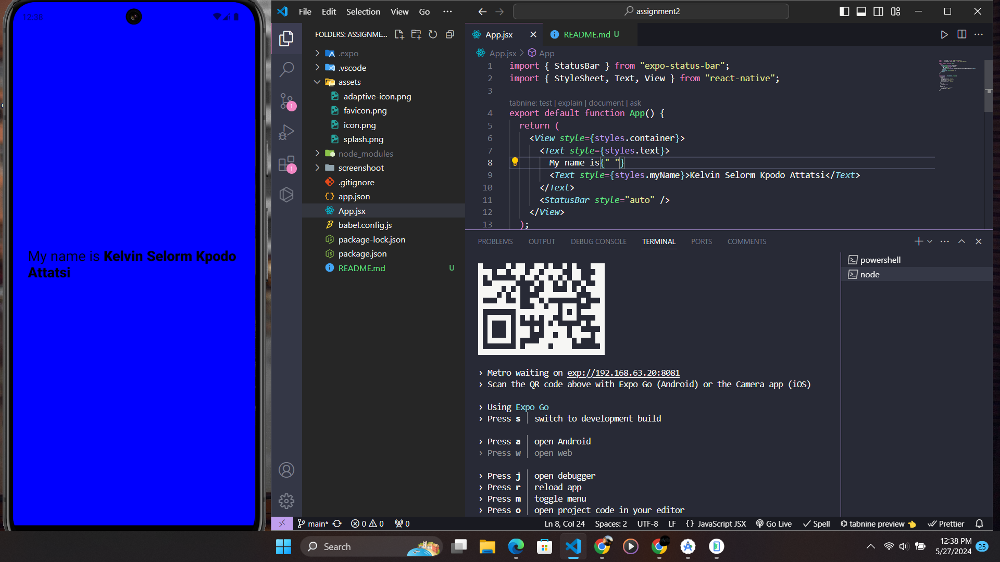

# rn-assignment2-11028723

## Description

This React Native project is created using Expo CLI. The main objective of this project is to customize the appearance of the default template by changing the background color of the View component and modifying the Text component to display "My name is Kelvin Selorm Kpodo Attatsi" with increased font size and bold styling for the name.

## Task Details

- **Background Color**: Changed the background color of the View component.
- **Text Component**:
  - Displayed the text "My name is Kelvin Selorm Kpodo Attatsi".
  - Increased the font size of the text to 24.
  - Made "kelvin Selorm Kpodo Attatsi" bold.

## Student ID

11028723

## Screenshot



## Instructions to Run the Project

1. Clone the repository:

   ```bash
   git clone https://github.com/KelvinLinnaeus/rn-assignment2-11028723.git
   cd rn-assignment2-11028723
   ```

2. Install the dependencies:

   ```bash
   npm install
   ```

3. Start the Expo development server:

   ```bash
   npx expo start
   ```

4. Use the Expo Go app on your mobile device or an emulator to view the application.
